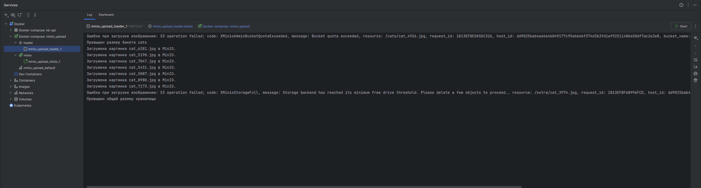
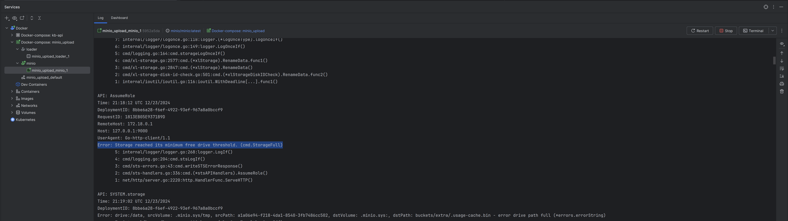

# minio_overload_cats
## Запуск программы

```bash
docker-compose up -d
```

## Переполнение хранилища
Скрипт сначала заполняет бакет **cats**, которому с помощью настроек minio выделена квота на 12MiB.

ьinio client возвращает ошибку, что переполнен бакет.


Затем загружаем ещё несколько изображений в бакет **extra** для переполнения всего отведённого хранилищу Minio места в tmpfs.

Получаем ошибку, что переполнено хранилище.


Так как Minio не сразу возвращает результат загрузки изображений, то информация о переполнении выводится не последовательно.
